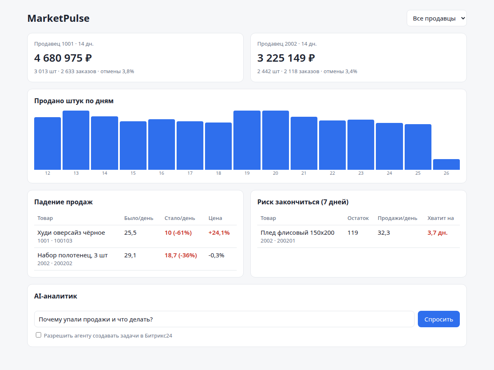
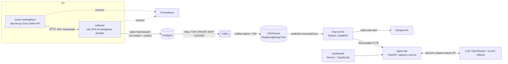
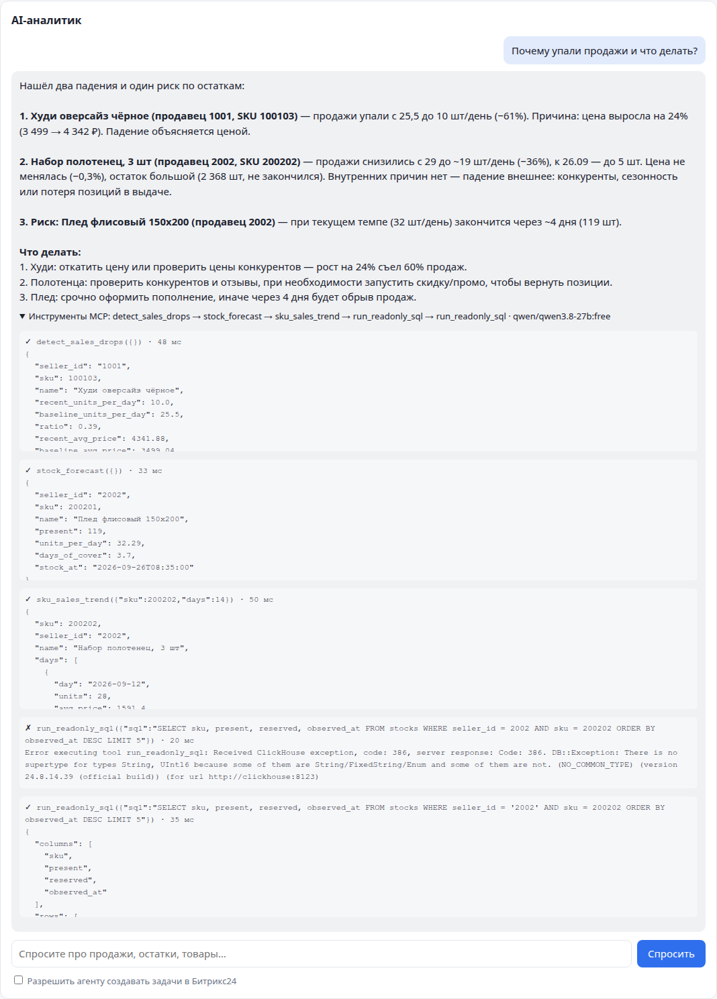

# MarketPulse — AI-аналитик продаж для продавцов маркетплейсов

Сервис собирает заказы и остатки из API маркетплейса, прогоняет их через событийный
конвейер (Go → Postgres outbox → Kafka → ClickHouse) и даёт LLM-агенту аналитические
инструменты через **MCP**. Агента можно спросить «почему упали продажи и что делать».
Он сам решает, какие инструменты вызвать, отличает падение из-за цены от падения из-за
остатков или внешних причин и может завести задачу в **Битрикс24**.



> **Про данные.** Кабинета продавца на Ozon у меня нет, поэтому источник — собственный
> эмулятор подмножества **Ozon Seller API** (`/v3/posting/fbs/list`, `/v4/product/info/stocks`)
> с тем же форматом ответов, пагинацией (offset/has_next и cursor), лимитом запросов (429 +
> Retry-After) и авторизацией `Client-Id`/`Api-Key`. Данные синтетические, но
> детерминированные, и в них заложены аномалии, на которых проверяется агент. Сборщик
> написан против контракта API, так что для реального кабинета достаточно поменять
> `MARKET_URL` и ключи.

## Архитектура



| Компонент | Стек | Что показывает |
|---|---|---|
| [`internal/market`](internal/market), [`cmd/mock-marketplace`](cmd/mock-marketplace) | Go | Эмулятор API: детерминированная генерация заказов по 10-минутным окнам, суточный и недельный профиль спроса, остатки не уходят в минус, лимит запросов на клиента |
| [`internal/collector`](internal/collector), [`cmd/collector`](cmd/collector) | Go, pgx, kafka-go | Rate limiter на каждого продавца, экспоненциальный backoff с джиттером и учётом `Retry-After`, обход пагинации, transactional outbox, идемпотентные ключи событий |
| [`clickhouse/init`](clickhouse/init) | ClickHouse | ClickHouse сам читает Kafka (движок `Kafka` + материализованные представления), `ReplacingMergeTree(status_rank)` схлопывает повторы и оставляет последний статус |
| [`mcp-server`](mcp-server) | Python, MCP SDK, clickhouse-connect | 7 инструментов для агентов, параметризованные запросы, отдельный readonly-пользователь ClickHouse, защита произвольного SQL, интеграция с Битрикс24 |
| [`agent-api`](agent-api) | Python, FastAPI, OpenAI SDK | Харнесс агента без фреймворка: tool calling поверх MCP, ограничение побочных эффектов, бюджет контекста, лимит шагов, trace вызовов, фолбэк моделей через OpenRouter |
| [`dashboard`](dashboard) | Next.js 15, React 19, TypeScript | KPI, график, таблицы аномалий и рисков, чат с агентом и раскрываемым trace инструментов |
| [`monitoring`](monitoring) | Prometheus | Метрики сборщика (запросы по кодам ответа, очередь outbox, длительность синхронизаций) и эмулятора |

## Инженерные решения

**Надёжная доставка событий (transactional outbox).** Сборщик в одной транзакции
обновляет состояние отправления и пишет событие в таблицу `outbox`. Отдельный relay
публикует события в Kafka и отмечает их отправленными. Если процесс упадёт между этими
шагами, событие просто уйдёт повторно (at-least-once), а дубли погасит следующий слой.

**Идемпотентность на каждом уровне.**
- Ключ события — `продавец | отправление | статус | SKU`. Перечитывание окна последних
  48 часов (нужно, чтобы поймать смену статусов) не создаёт новых событий, если статус
  не менялся: `ON CONFLICT DO NOTHING` и сравнение с `posting_state`.
- В ClickHouse `ReplacingMergeTree` с версией `status_rank`: повторная доставка
  схлопывается, и побеждает более поздний статус, даже если события пришли не по порядку.
- Проверено: после рестарта сборщика и повторных циклов число отправлений в Postgres
  совпадает с числом строк в ClickHouse после `FINAL`.

**Лимиты API.** У каждого продавца свой токен-бакет (`golang.org/x/time/rate`), поэтому
один продавец не съедает общую квоту. На 429 и 5xx — повтор с backoff и учётом
`Retry-After`, на остальные 4xx — сразу ошибка (повтор не поможет).

**Безопасный доступ LLM к данным.** Три уровня защиты:
1. Готовые инструменты с параметризованными запросами (`{sku:UInt64}`), а не SQL из строки.
2. Для `run_readonly_sql`: только один запрос `SELECT/WITH`, запрещённые ключевые слова
   блокируются (с учётом строковых литералов).
3. MCP-сервер ходит в ClickHouse отдельным пользователем с профилем `readonly`, лимитом
   времени, числа строк и памяти. Даже если что-то пройдёт мимо проверки SQL, ClickHouse
   это не выполнит.

**Харнесс агента** ([`agent-api/harness.py`](agent-api/harness.py)):
- инструменты с побочным эффектом (`create_bitrix24_task`) скрыты от модели, пока
  пользователь явно не разрешил действия, и дополнительно проверяются при вызове;
- ответ инструмента обрезается перед возвратом в контекст, с подсказкой модели сузить запрос;
- ошибка инструмента возвращается модели как текст, чтобы она могла исправить аргументы,
  а не ронять запрос;
- лимит шагов: на последнем шаге инструменты отключаются, и модель обязана ответить;
- полный trace вызовов (аргументы, время, превью результата) уходит в UI;
- фолбэк моделей: OpenRouter переключается на запасную модель при лимите или ошибке.

**Битрикс24.** Через входящий вебхук вызывается `tasks.task.add`. Без вебхука инструмент
работает в dry-run и возвращает ровно тот запрос, который был бы отправлен.

## Пример работы агента

Вопрос: «Почему упали продажи и что делать?» (модель `qwen/qwen3.8-27b:free` через OpenRouter)

Агент сам вызвал `detect_sales_drops → stock_forecast → sku_sales_trend → run_readonly_sql → run_readonly_sql`
и ответил:

> Нашёл два падения и один риск по остаткам:
>
> **1. Худи оверсайз чёрное (продавец 1001, SKU 100103)** — продажи упали с 25,5 до 10 шт/день (−61%).
> Причина: цена выросла на 24% (3 499 → 4 342 ₽). Падение объясняется ценой.
>
> **2. Набор полотенец, 3 шт (продавец 2002, SKU 200202)** — продажи снизились с 29 до ~19 шт/день (−36%).
> Цена не менялась (−0,3%), остаток большой (2 368 шт, не закончился). Внутренних причин нет — падение
> внешнее: конкуренты, сезонность или потеря позиций в выдаче.
>
> **3. Риск: Плед флисовый 150x200 (продавец 2002)** — при текущем темпе (32 шт/день) закончится через ~4 дня.

Видно, как работает харнесс: первый `run_readonly_sql` упал с ошибкой типов ClickHouse
(`seller_id = 2002` без кавычек). Агент получил текст ошибки как результат инструмента,
сам исправил запрос на `seller_id = '2002'` и продолжил работу.



Все три сценария (рост цены, падение без изменения цены, скорое окончание остатка)
заложены в эмулятор ([`internal/market/catalog.go`](internal/market/catalog.go)), так что
качество ответов агента можно проверять воспроизводимо.

## Запуск

Нужен Docker с Compose. Всё собирается и работает в контейнерах.

```bash
cp .env.example .env        # укажите LLM_API_KEY (ключ OpenRouter; подходят бесплатные :free модели)
docker compose up -d --build
```

| Что | Адрес |
|---|---|
| Дашборд | http://localhost:3300 |
| Agent API (Swagger) | http://localhost:18088/docs |
| MCP-сервер (Streamable HTTP) | http://localhost:18000/mcp |
| ClickHouse HTTP | http://localhost:18123 |
| Эмулятор API | http://localhost:18080 |
| Prometheus | `docker compose --profile monitoring up -d`, затем http://localhost:19090 |

Первичная загрузка 30 дней истории (~10,7 тыс. отправлений) занимает несколько секунд,
дальше сборщик синхронизируется раз в минуту.

MCP-сервер можно подключить к любому MCP-клиенту (Claude Desktop, Cursor и т.п.) по адресу
`http://localhost:18000/mcp`.

Запрос к агенту из консоли:

```bash
curl -s localhost:18088/api/chat -H 'Content-Type: application/json' \
  -d '{"message": "Что заканчивается на складе у продавца 2002?", "allow_actions": false}'
```

## Тесты

```bash
docker build -f go.Dockerfile --target test .           # go vet + go test
docker compose run --rm mcp-server python -m pytest -q  # защита SQL, payload Битрикс24
```

Go-тесты покрывают детерминированность генератора, неотрицательные остатки, заложенные
аномалии, авторизацию, 429 и изоляцию лимитов между клиентами, повторы при 429 с учётом
`Retry-After`, отсутствие повторов на 400, обход всех страниц и идемпотентность ключей событий.

## Что дальше

- Kubernetes: Helm-чарт и манифесты, Terraform для кластера.
- Grafana-дашборды поверх уже собираемых метрик Prometheus.
- vLLM для локального инференса вместо внешнего API.
- LoRA-дообучение небольшой модели на классификацию причин падения продаж.
- Реальный кабинет Ozon или Wildberries вместо эмулятора.

## Лицензия

MIT
